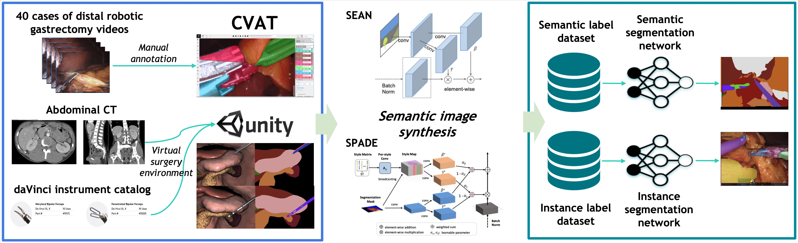

# SSIDB: Large-scale Dataset for Semantic Surgical Image Using Semantic Image Synthesis with Virtual Patient Model
 The process of generating and evaluating surgical image segmentation data of the SSIDB datset
<div style="text-align: center"><iframe width="560" height="315" src="https://www.youtube.com/embed/lQLCXpHTwNE" title="YouTube video player" frameborder="0" allow="accelerometer; autoplay; clipboard-write; encrypted-media; gyroscope; picture-in-picture" allowfullscreen></iframe></div>

## What is SSIDB dataset?
SSIDB (Semantic Surgical Image DataBase), a large-scale dataset consisting of real and synthetic data based on a virtual patient model and generative models, is an efficient solution to obtain surgery data. SSIDB is a dataset for pixel-level localization of surgical instruments and organs. The real data was constructed using 40 cases of distal gastrectomy videos in consideration of demographic and clinical variations. SSIDB provides virtual model-based semantic image synthesis data for the first time as
a visual recognition dataset in computer vision-based surgical field.

## Data Description
* **Real:** Real data obtained from gastrectomy surgery videos
* **Synthetic(SYN):** Synthetic data obtained from a virtual patient model built in the Unity envrionment
* **Domain Randomization(DR):** Synthetic data with domain randomization method obtained from a virtual patient model built in the Unity envrionment
* **SEAN/SPADE:** Semantic image synthesis(SEAN/SPADE) data generated from SYN/DR
  * **DR for SEAN/SPADE:** Unlike original DR, instruments are copied from original DR and pasted on the Real data for better synthesis.

### Original Data
Example images

| Data Type | Image                                       |
| --------- | ------------------------------------------- |
| Real      |  |
| SYN       |   |
| DR        |    |


### Semantic Image Synthesis Data
Example images

| Data Type | Original                | SEAN                     | SPADE                     |
| --------- | ----------------------- | ------------------------ | ------------------------- |
| SYN       |   |   |  |
| DR        |   |   |   |


## Data Statistics(Count)
* Data statistics for cross-validation set 1
* SIS: Semantic Image Synthesis(SEAN/SPADE) data
  
| Class                           | Real1 | SYN  | DR   | SIS(DR) |
| ------------------------------- | ----- | ---- | ---- | ------- |
| Harmonic Ace Head               | 1313  | 289  | 591  | 539     |
| Harmonic Ace Body               | 1267  | 297  | 766  | 559     |
| Maryland Bipolar Forceps Head   | 1454  | 297  | 580  | 593     |
| Maryland Bipolar Forceps Wrist  | 1092  | 286  | 577  | 466     |
| Maryland Bipolar Forceps Body   | 672   | 273  | 770  | 396     |
| Cadiere Forceps Head            | 1083  | 515  | 0    | 404     |
| Cadiere Forceps Wrist           | 892   | 441  | 0    | 323     |
| Cadiere Forceps Body            | 850   | 407  | 0    | 303     |
| Curved Atraumatic Grasper Head  | 700   | 592  | 887  | 230     |
| Curved Atraumatic Grasper Body  | 787   | 591  | 1053 | 267     |
| Stapler Head                    | 328   | 293  | 646  | 247     |
| Stapler Body                    | 305   | 298  | 879  | 291     |
| Medium Large Clip Applier Head  | 287   | 300  | 607  | 212     |
| Medium Large Clip Applier Wrist | 230   | 299  | 608  | 190     |
| Medium Large Clip Applier Body  | 140   | 287  | 778  | 240     |
| Small Clip Applier Head         | 277   | 300  | 540  | 198     |
| Small Clip Applier Wrist        | 260   | 300  | 544  | 191     |
| Small Clip Applier Body         | 183   | 299  | 742  | 203     |
| Suction                         | 286   | 298  | 779  | 238     |
| Needle                          | 286   | 299  | 609  | 256     |
| Endotip                         | 298   | 300  | 820  | 249     |
| Specimenbag                     | 506   | 0    | 0    | 201     |
| DrainTube                       | 304   | 300  | 794  | 246     |
| Liver                           | 2779  | 3143 | 349  | 1047    |
| Stomach                         | 2252  | 3299 | 355  | 821     |
| Pancreas                        | 1450  | 3165 | 301  | 529     |
| Spleen                          | 274   | 3016 | 328  | 95      |
| Gallbladder                     | 815   | 2159 | 246  | 300     |
| Gauze                           | 2701  | 0    | 0    | 1007    |
| The Other Instruments           | 1435  | 0    | 0    | 523     |
| The Other Tissues               | 3367  | 0    | 0    | 1236    |
| Background                      | 3375  | 3300 | 1228 | 1236    |

## Per-class Performance(Real vs Synthetic)
### Instance Segmentation(Performance differences between Synthetic and Real)


## Data Download
* Data will be available after final decision.

| Data Type | Link |
| --------- | ---- |
|           |      |

## Model Zoo
You can download models and test them.<br />

**Semantic Segmentation([link](https://drive.google.com/drive/folders/159lmAyghNB8jV9mSwYI3cFIcKhqVtzId?usp=sharing))**

| Algorithm   | Backbone | Data            | mIoU/mAcc/aAcc                                    |
| ----------- | -------- | --------------- | ------------------------------------------------- |
| DeepLab V3+ | ResNeSt  | Real1           | 74.68/<br />82.99/<br />87.72                                 |
| DeepLab V3+ | ResNeSt  | Real1+SEAN(SYN) | 75.58(**+0.9**)/<br />83.81(**+0.82**)/<br />88.09(**+0.37**) |

**Instance Segmentation([link](https://drive.google.com/drive/folders/1f0bOPiVqWMWvSg-9JBQPTE8WwhFEOGvz?usp=sharing))**

| Algorithm                                     | Backbone      | Data                | bboxAP/maskAP                 |
| --------------------------------------------- | ------------- | ------------------- | ----------------------------- |
| Hybrid Task Cascade for Instance Segmentation | Resnet101-FPN | Real1               | 53.9/<br />55.0                     |
| Hybrid Task Cascade for Instance Segmentation | Resnet101-FPN | Real1+SEAN(SYN)     | 54.3(**+0.4**)/<br />57.2(**+2.2**) |
| Cascade Mask R-CNN                            | Resnet101-FPN | Real1               | 51.2/51.0                     |
| Cascade Mask R-CNN                            | Resnet101-FPN | Real1+SPADE(SYN+DR) | 52.5(**+1.3**)/<br />53.6(**+2.6**) |


## Baseline Models
### Semantic Segmentation
#### Installation
* Download source code and install from [our mmsegmentation](https://github.com/SSIDB/mmsegmentation) which we modified for our use.

#### Test
* Download config & checkpoints above and follow instructions below.
```bash
$cd mmsegmentation/demo  # change directory to demo in mmsegmentation
$python3 image_demo.py demo_images/{demo.jpg} \
{config.py} {checkpoint.pth}
```


### Instance Segmentation
#### Installation
* Download source code and install from [our mmdetection](https://github.com/SSIDB/mmdetection) which we modified for our use.

#### Test
* Download config & checkpoints above and follow instructions below.
```bash
$cd mmdetection/demo  # change directory to demo in mmdetection
$python3 image_demo.py demo_images/{demo.jpg} \
{config.py} {checkpoint.pth}
```

